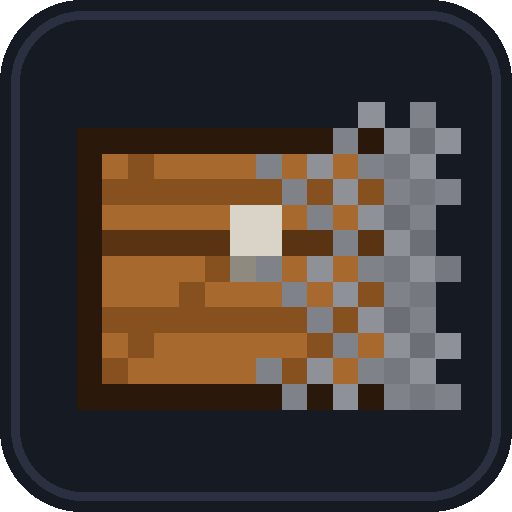

# OutOfSight



A Paper plugin that stops base finding, the cheat capability Minecraft's own
anti-xray does not cover.

[Türkçe README](README.tr.md)

## The problem

Paper ships anti-xray, and for ores it works. Measured on a test server with
`engine-mode: 2`, an X-ray user sees roughly 196,000 "ores" of which 215 are real,
about 1 in 900.

Chests are a different story. A chest goes into the chunk packet twice, once as a
block state and once as an entry in a separate block-entity list. Anti-xray works
on block states, so that list goes out untouched with the coordinates in it.

The same experiment, a chest and a diamond ore sealed in one stone shell, both in
the default `hidden-blocks` list, run once per engine mode:

```
engine-mode 1
  chest        block=hidden(stone)                block-entity=LEAKED
  diamond ore  block=hidden(stone)                block-entity=none

engine-mode 2
  chest        block=LEAKED(chest)                block-entity=LEAKED
  diamond ore  block=hidden(deepslate_copper_ore) block-entity=none
```

The ore is hidden in both modes and the chest gives its position away in both.
Mode 1 at least replaces the block with stone. Mode 2, the stronger mode for ores,
does not even do that. Block ESP and chunk finders work in that gap.

| Target | engine-mode 1 | engine-mode 2 |
|---|---|---|
| Ores | hidden | hidden, 1 real in ~900 |
| Chests, spawners, barrels | block hidden, position still leaks | both leak |

## What this plugin does

### Shield

Off by default. Installing this plugin changes nothing about what your players see
until you turn the shield on, and the audit works either way without modifying a
single packet.

Before switching it on for everyone, `shield.test-mode` limits it to players
holding `outofsight.shielded`. Run `/outofsight testme`, relog, and check you can
still find and open your own containers. Nobody else is affected. A small server
often has no permissions plugin, so that command grants the permission itself.

Removes containers a player cannot see from outgoing chunk packets. It drops the
block-entity record and replaces the block state with a neighbouring block. Both
steps are needed, since dropping only the record still renders a chest, and
changing only the block leaves the position readable in the raw list.

The rule is default deny. A container goes out only once the main thread has
decided this player may see it, which means being close enough and having an
unobstructed line to it. A network thread cannot read the world, so all it checks
is whether this player has been given this container yet.

Two things decide delivery:

1. Distance. Base finding is a long range attack by definition, since the cheat
   loads chunks out to render distance and reads every container at once. Vanilla
   clients do not draw block entities much past this range either, so withholding
   the distant ones costs an honest player nothing.
2. Line of sight. Distance alone lets someone standing on a hill collect the
   contents of a base buried under it. A ray from the player's eye settles whether
   anything is in the way.

A block with six solid neighbours cannot have a line of sight, so that cheap test
runs first and skips the ray for anything sealed in stone. Enclosure on its own
would be a poor rule, since a chest anyone can open has air above it.

The ray only runs for containers not yet delivered, and a player who has not moved
in a world that has not changed is skipped entirely. Walking into a base with fifty
chests costs rays while you move and none once you stand still.

Events cannot catch every change, since commands, WorldEdit, pistons and flowing
water produce no `BlockBreakEvent`. A slower sweep re-reads the block entities of
nearby chunks, which both finds containers nothing reported and drops ones that no
longer exist. A container left hidden by mistake means a player loses their items,
which is what that sweep exists to prevent.

### Storage vehicles

Chest minecarts, hopper minecarts and chest boats are entities, not blocks, so
the shield above never sees them. Storage ESP draws them anyway, and a line of
hopper minecarts under a farm points at a base as plainly as a chest.

They follow the same default-deny rule: an entity is sent to a player only once
a ray from that player's eye reaches it. Distance plays no part, so anything in
plain view stays visible as far as the client draws it. Paper's
`hideEntity` keeps the tracker quiet, and because it is per plugin it does not
fight other plugins that hide or show the same entity. It cannot stop the
tracker's very first spawn packet, so a packet listener drops that one for any
entity not yet shown. A vehicle someone is riding is never hidden, since that
would show a player floating on nothing. Players themselves cannot be listed:
hiding a player also removes them from the tab list.

`shield.protected-entities` takes more types. `item_frame`, `glow_item_frame` and
`armor_stand` are worth adding against collectible ESP; since only line of sight
decides, map walls and shop displays in the open are unaffected.

### Config advisor

Paper's anti-xray handles X-ray and netherite finders, and it ships switched off. Its default `hidden-blocks` list also has no
`ancient_debris`, `spawner`, `barrel` or `trapped_chest`. On startup, and on
`/outofsight advise`, the plugin reads `config/paper-world-defaults.yml` and each
world's `paper-world.yml` and reports what is left open. It never changes them.

### Decoys (optional, off by default)

The server plants fake buried chests, so someone hunting bases digs sixty blocks
and finds nothing. After a few of those the cheat's data stops being worth acting
on.

A decoy is only ever visible to a cheat, because legitimate play is local and
cheating is global. A block sealed in stone has no line of sight to a normal
player, while a cheat reads every loaded chunk at once. The only risk is a player
digging into one by chance, so decoys quietly revert to the real block as a player
approaches. Chunk packets are sent from 100+ blocks away and correction runs within
3 chunks, which leaves no window to reach one.

A cheater who notices that chests vanish on approach ends up trusting only what is
close, which is what a legitimate player sees anyway.

Positions are deterministic. Random ones would move every time a chunk is resent,
which flickers and signals that the server is fabricating data.

Decoys go in one chunk in four rather than every chunk. Sparse decoys poison the
data just as well, and most of the cost is re-serialising every packet you touch.
Thinning drops that from 100% of packets to 28%.

### Audit

`XrayAudit` compares outgoing chunk packets against the real world and reports what
leaks, per block type. It separates exposed leaks, which a player can see anyway,
from buried ones, which are the genuine problem. Both channels are inspected: block
states and the block-entity list.

Comparing types matters because `engine-mode: 2` replaces each buried ore with a
*random different* ore, so asking only "is there an ore here" reports a false 58%
leak rate. This project made that exact mistake before fixing it.

### Reach check

A ping-compensated hit distance check, included as a worked example.
[Grim](https://grim.ac/) reimplements vanilla movement tick by tick and nothing
here approaches that. Three deliberate choices, all about not flagging legitimate
players:

1. Distance is measured to the target's bounding box, not its centre.
2. Attacker and victim are both rewound by the attacker's latency, and the closest
   moment in that window is used, so doubt favours the player.
3. A single violation carries no penalty. Violations accumulate and decay.

Range is read from the player's `ENTITY_INTERACTION_RANGE` attribute rather than
hardcoded. That showed up immediately in testing: creative allows 5.03, survival
3.03. A hardcoded 3.0 would flag every creative hit.

## What Krypton-style clients can still do

Checked against the feature list of Krypton, a paid Fabric cheat client popular
on SMP servers. Information cheats are only beaten by not sending the
information; action cheats need a real anticheat.

| Cheat feature | Status | Answered by |
|---|---|---|
| Storage ESP, block ESP, stash finder | Blocked | Shield |
| Spawner ESP / notifier | Blocked | Shield (`spawner`), plus anti-xray `hidden-blocks` |
| Chest and hopper minecarts, chest boats | Blocked | Storage vehicles |
| Collectible ESP: banners | Blocked | Shield (`#banners`) |
| Collectible ESP: item frames, armor stands | Opt-in | Add them to `protected-entities` |
| X-ray, netherite finder | Paper anti-xray | `/outofsight advise` checks the settings |
| Mob / entity ESP | Opt-in for mobs | `protected-entities`; players are never hidden |
| SUS chunk finder, seed-based finders | Partly | Keep the seed private; `advise` checks feature seeds |
| Hole, tunnel and stairs ESP, 1x1 holes | Not blockable | The client needs terrain shape to render and collide |
| KillAura, aim assist, crystal and anchor aura | Not here | Use [Grim](https://grim.ac/) |
| Auto totem | Not here | Not reliably detectable server-side |
| Speed, fly, elytra auto fly, auto mine | Not here | Use Grim |

Movement and combat checks are left to Grim on purpose. It simulates vanilla
movement tick by tick, which is what it takes to flag these cheats without
flagging honest players on bad connections. It also runs on PacketEvents, next to
this plugin, without conflict.

## Requirements

- Paper (or a fork such as Purpur) 1.21.11, 26.1, 26.2 or 26.3
- [PacketEvents](https://github.com/retrooper/packetevents) 2.13.0+ on 1.21.11, 2.14.0+ on 26.x
- Java 21, or Java 25 on 26.x

CI runs the end-to-end test on 1.21.11, 26.1.2, 26.2 and 26.3 with the same
jar. On 26.x it joins through ViaVersion and ViaBackwards, so those are covered
too. Folia and Spigot are not supported.

## Commands

All require `outofsight.admin` (op by default).

| Command | Purpose |
|---|---|
| `/outofsight xray [chunks]` | Audit outgoing chunk packets for leaks |
| `/outofsight hidechest` | Place a buried chest + control ore, then relog to test |
| `/outofsight shield` | Toggle the shield |
| `/outofsight testme` | Shield yourself only, for testing |
| `/outofsight advise` | Report what Paper's anti-xray and seed settings leave open |
| `/outofsight reachdebug` | Log the measured distance of every hit |
| `/outofsight reachsim <d>` | Show where the reach threshold sits |
| `/outofsight stress <n>` | Build a dense field of buried chests for load testing |
| `/outofsight perf` / `perfreset` | Cost measurements |

## Performance

Measured with bots that teleport constantly to force chunk loading, a far heavier
load than normal play, at roughly 400 to 700 chunk packets per second.

These runs predate the storage vehicle shield. Its sweep adds main-thread work
that the table does not include yet.

| Scenario | Packets | Modified | Network (µs/pkt) | Main thread | MSPT / TPS |
|---|---|---|---|---|---|
| 20 bots, empty world | 37 992 | 94 | 11.9 | 1.24 ms | 19.90 / 20.00 |
| 20 bots, 256 buried chests | 25 838 | 866 | 14.9 | 0.84 ms | 8.94 / 20.00 |
| 40 bots, 256 buried chests | 41 287 | 1 466 | 13.5 | 0.79 ms | 10.76 / 20.00 |
| 20 bots, decoys on (1 in 4) | 22 325 | 6 209 | 18.4 | 0.68 ms | 9.11 / 20.00 |
| 20 bots, line of sight rule | 21 380 | 1 807 | 19.9 | 0.44 ms | 10.30 / 20.00 |

The shield runs on network threads, so it costs latency rather than TPS. At 40
bots that is roughly 0.9% of one core. The only main-thread work is the sweep, at
0.8 ms every two seconds, or 0.04% of a 50 ms tick budget. TPS stayed at 20.00 in
every run, with no exceptions.

## Honest limits

- Re-serialisation cost is not measured. The counters cover only this plugin's own
  code, and rewriting the packet happens inside PacketEvents after listeners run.
  Enabling decoys touches more packets and raises it. TPS was unaffected because
  the work is on network threads, but there is no measured figure for it.
- Tested up to 40 bots on one world. A 100+ player server has not been measured.
- Containers placed without an event (commands, WorldEdit, a dispenser placing a
  shulker box) are found by the sweep, which only covers chunks near players.
  Until a player comes within `sweep-radius-chunks`, players farther out can
  receive them.
- Chest-type registry ids are learned from live packets. If that fails, set
  `shield.decoy-block-entity-type` manually.
- A container comes into view up to `deliver-interval-ticks` late, a quarter of a
  second by default. Lower it if that is visible on your server.
- The reach check does not replace a real anticheat. No movement simulation, so no
  fly, speed or noslow detection.
- `engine-mode: 2` costs CPU on its own. Measure your tick time before enabling it.

## Verification harness

CI runs `harness/e2e.mjs` on every push. It starts Paper 1.21.11 with
PacketEvents, builds a known scene with console commands and joins with a
headless client that decodes every chunk, block update and entity spawn it
receives. It checks buried, far and plainly visible chests, an end-on double
chest, the Nether, and buried and visible chest minecarts, then turns the
shield off and confirms the same buried chest leaks.

The scripts below are for manual runs against a local server. They check
behaviour from the client's point of view, which is the only view that works here:
the server-side audit reads the raw buffer and never sees the shield's changes.

```
node relog.mjs <name> <ms> ["command"]   # connect, run a command, leave
node inspect.mjs <x> <y> <z>             # what the chunk packet carries at a position
node watch.mjs <x> <y> <z>               # whether a container is delivered later
node dig.mjs <x> <y> <z>                 # break the wall, watch for the reveal
node decoytest.mjs                       # decoy distribution, near vs far
node loadtest.mjs <bots> <secs>          # load generation
```

## Building

```
cd plugin && gradle build
```

Unit tests cover the reach math, weighted towards false-positive cases, plus the
container index and decoy placement:

```
cd plugin && gradle test
```

## Credits

Testers who reported a problem, or shared what their server actually leaked, are
named here. If you filed something that changed the code, open a pull request
adding yourself, or say so on the issue and it will be added.

(nobody yet)

## Footnote

Krypton is a noble gas. Fluorine is the only element reactive enough to make it
bond. This is not fluorine, but it does ruin its day.

## License

GPL-3.0. PacketEvents is GPL-3.0 and this plugin links against it, so the combined
work is GPL-3.0 and its source must remain available to anyone who receives it.
